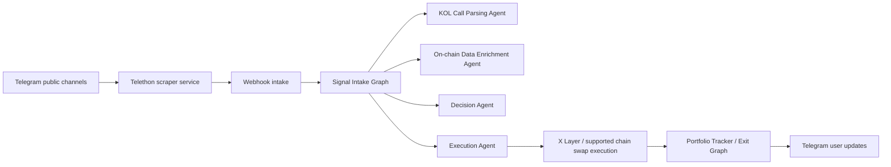
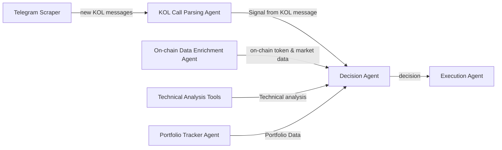

# GIST Agent System

<p align="center">
  <strong>Agentic KOL copy trading infrastructure for X Layer</strong><br />
  Telegram signal intake, AI reasoning, deterministic policy gates, and OKX OnchainOS-backed execution.
</p>

<p align="center">
  <a href="https://github.com/gist-kol-copy-trade-agent/agent-system">Public Repo</a>
</p>


## Overview

GIST Agent System is an agentic on-chain trading assistant built for the X Layer ecosystem.
It watches public Telegram KOL channels, parses trade calls, enriches them with on-chain data, applies deterministic policy gates, and executes same-chain spot swaps through an OKX Agentic Wallet.

This is not a generic chatbot and not a cross-chain trading terminal.
It is a single-operator trading system designed around:

- fast reaction to KOL calls,
- explainable AI reasoning,
- deterministic risk control,
- same-chain execution on X Layer and supported chains,
- honest runtime boundaries between agent reasoning and trade side effects.

## Project Intro

The system automates the operational path that usually happens manually:

1. read a KOL message in Telegram,
2. decide whether it is an actionable trade call,
3. resolve the token and chain,
4. collect wallet, market, liquidity, and risk context,
5. reason about whether the trade should be taken,
6. apply hard policy gates,
7. execute via OKX OnchainOS swap flow,
8. monitor the open position and decide exits later.

The current MVP focuses on two asset lanes:

- `major lane`: `BTC`, `ETH`, `SOL`, executed through canonical X Layer representations
- `regular lane`: resolved token contract + chain, with fuller security and market checks

Cross-chain swap is intentionally out of scope in this version.

## Onchain Identity and Deployment Address

This project uses an **OKX Agentic Wallet** as its on-chain identity.
Each deployed bot instance creates and manages its own wallet session during onboarding through `/start`.

Important note:

- the wallet identity is **per deployment / per operator**
- the repo does **not** hardcode or publish a shared hot-wallet address
- after the first successful wallet login, the live deployment address can be inspected via `/status`

This choice is deliberate: the bot is designed to trade from the operator's own Agentic Wallet session, not from a shared project treasury.

## Architecture Overview

At runtime the system is split into a Telegram-facing bot, a scraper service, and LangGraph-based trading workflows.



The implementation uses:

- `LangChain` for bounded agents and tool binding
- `LangGraph` for workflow orchestration, checkpoints, and stateful graph execution
- `Postgres` for business persistence
- `FastAPI` for webhook and runtime HTTP surfaces
- `python-telegram-bot` for polling bot UX
- `Telethon` in the scraper service for public channel ingestion

## Agent Network

The main agent roles are shown below:



### 1. KOL Call Parsing Agent

- Reads raw Telegram text, and optional image attachments if present
- Classifies `trade_call`, `trade_update`, `exit_signal`, or `noise`
- Extracts symbol, contract clues, chain hints, and entry references
- Uses model reasoning because KOL language is noisy and inconsistent

### 2. On-chain Data Enrichment Agent

- Loads wallet, market, token, and risk context
- Resolves the active Agentic Wallet address for the relevant chain
- Pulls K-line / market / token-security data before any decision is made
- Produces structured snapshots, not final trade authority

### 3. Technical Analysis Tools

- Deterministic TA layer built by the application
- Computes TA and trigger inputs from fetched K-line windows
- Kept outside the model so scoring stays auditable and reproducible

### 4. Decision Agent

- Reasons over already-collected data
- Decides `execute`, `skip`, or `block`
- Does not call execution directly
- Produces structured explainability artifacts for Telegram updates

### 5. Execution Agent

- Only runs after deterministic policy approval
- Builds the swap execution request
- Uses bounded mutating OKX execution tools
- Returns execution receipts and route summaries

### 6. Portfolio Tracker Agent

- Refreshes position and wallet PnL context
- Supports `/portfolio`
- Feeds the exit workflow with live market and PnL state

### 7. Exit Agent

- Evaluates hold / hard-exit / trailing behavior on open positions
- Runs inside a separate LangGraph exit pipeline
- Leaves the final execution authorization to deterministic exit policy nodes

### 8. Wallet Agent

- Owns Agentic Wallet onboarding and `/status`
- Handles email login, OTP verification, wallet status, and address retrieval
- Makes the bot's on-chain execution identity explicit

### 9. History Agent

- Supports `/history`
- Loads DEX history for the operator wallet from OKX market capabilities
- Produces a user-facing trading history summary

## OKX OnchainOS Skill Usage

The system is built around **OKX OnchainOS skills**, not mocked prompts.
Core skills used in this repository include:

| Skill | Role in the system | Typical use |
| --- | --- | --- |
| `okx-agentic-wallet` | Wallet onboarding and wallet status | login, verify OTP, resolve wallet addresses, inspect wallet readiness |
| `okx-dex-market` | Market and PnL context | K-line, price, portfolio token PnL, recent wallet PnL, DEX history |
| `okx-dex-token` | Token metadata and advanced info | token search, token metadata, token advanced-info |
| `okx-security` | Regular-token risk scan | token-scan, tax / risk-control checks |
| `okx-dex-swap` | Buy and sell execution | quote and `swap execute` for same-chain spot trades |

Examples of core OnchainOS-backed capabilities used by the bot:

- `onchainos wallet status`
- `onchainos wallet addresses --chain xlayer`
- `onchainos market kline --address <token> --chain <chain>`
- `onchainos market portfolio-token-pnl --address <wallet> --chain <chain>`
- `onchainos security token-scan --chain <chain>:<token>`
- `onchainos swap execute --from <from> --to <to> --readable-amount <amount> --chain <chain> --wallet <wallet>`

This satisfies the requirement to use core modules from the Onchain OS skills surface.

## Working Mechanics

### Entry Pipeline

1. Scraper receives a new Telegram message from a followed public channel.
2. Scraper sends a signed webhook to the main app.
3. Signal Intake Graph starts in LangGraph.
4. Parsing Agent interprets the KOL message and extracts the trade candidate.
5. Asset resolution and lane classification happen.
6. Enrichment Agent loads wallet context, market context, token data, and risk context.
7. Deterministic TA tools compute the TA snapshot.
8. Decision Agent reasons over the prepared state.
9. Deterministic policy gate checks slippage, active positions, price deviation, liquidity, and wallet readiness.
10. Execution Agent performs the approved same-chain buy.
11. The system persists workflow state, execution results, and sends reasoning updates back to Telegram.

### Exit Pipeline

1. A cron-driven monitor selects active positions.
2. Portfolio Tracker Agent refreshes price, wallet PnL, and position state.
3. Deterministic exit TA computes hard-stop, take-profit, trailing-arm, trailing-fire, and max-hold triggers.
4. Exit Agent decides whether to hold or exit.
5. Deterministic exit policy maps the decision into `hold`, `persist_trailing`, `block`, or `execute`.
6. If approved, the Execution Agent submits the sell swap.
7. The system closes the position and reports the result in Telegram.

### Command Surface

Current command surface includes:

- `/start`
- `/status`
- `/trade-style`
- `/follow`
- `/stop`
- `/portfolio`
- `/history`

## Why This Fits X Layer

This project is positioned as an **AI-native execution layer for X Layer social trading**.

Within the X Layer ecosystem, it is valuable because it combines:

- X Layer-first execution for major assets
- Agentic Wallet as identity and execution boundary
- OnchainOS skills as the trusted on-chain capability layer
- Telegram-native signal capture, which is where much crypto intent actually appears first
- deterministic risk gates, which makes the system safer than a pure autonomous prompt loop

In short, the project aims to make X Layer the fastest place to turn social trading intent into explainable on-chain action.

## Repository Structure

```text
.
├── architecture/          # PRD, architecture notes, diagrams, contracts
├── implementation-plan/   # phased delivery plan
├── okx-onchainos-skills/  # local OKX skill pack references
├── scraper/               # Telethon + FastAPI scraper service
├── system/                # main bot runtime, agents, graphs, persistence, workers
├── docker-compose.yml     # full-stack local orchestration
└── RUNBOOK.md             # shared operational guide
```

## Local Run

For full-stack local run:

```bash
cp .env.example .env
docker compose up -d postgres scraper app-http
docker compose --profile telegram up -d app-telegram
docker compose --profile monitor up -d app-exit-monitor
```

Useful references:

- [`RUNBOOK.md`](RUNBOOK.md)
- [`system/README.md`](system/README.md)
- [`scraper/README.md`](scraper/README.md)

## Team

- `sniperman`
- `nvq`

## Public Repository

- GitHub: `https://github.com/gist-kol-copy-trade-agent/agent-system`

## Notes

- The README describes the implemented MVP architecture, not an aspirational future state.
- The bot currently focuses on same-chain spot execution and does not perform cross-chain swaps.
- The deployment wallet address is intentionally dynamic because the project is built around operator-owned Agentic Wallet sessions.
