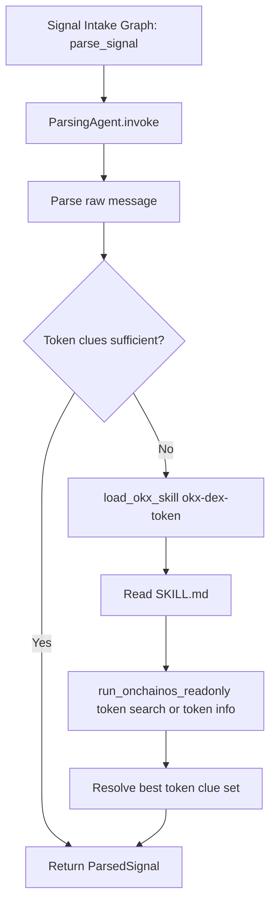
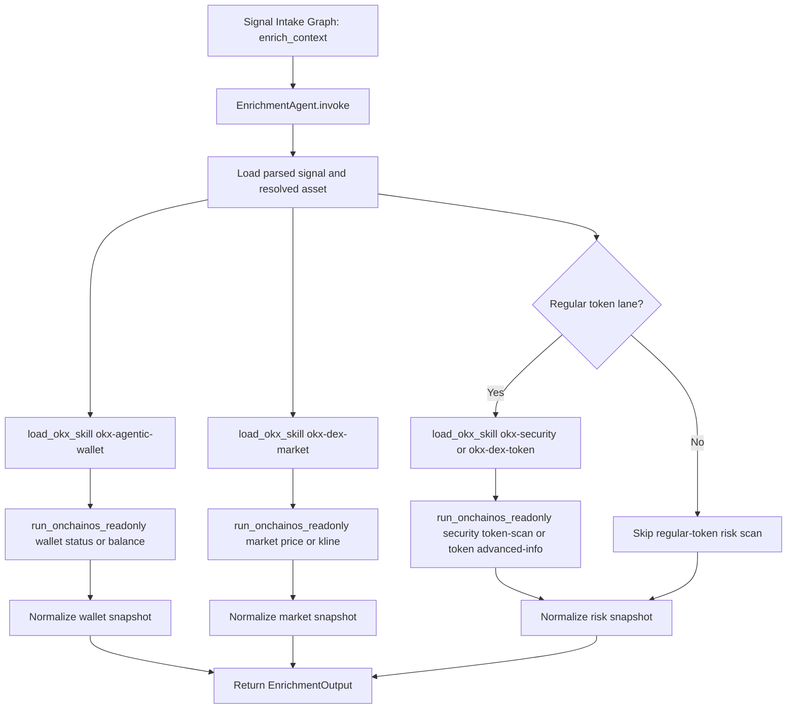
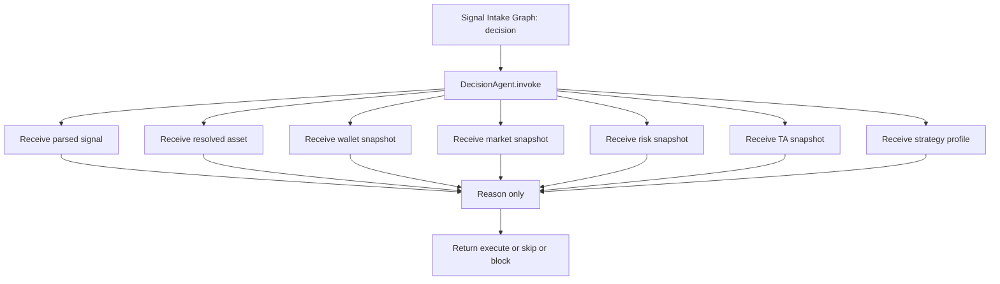
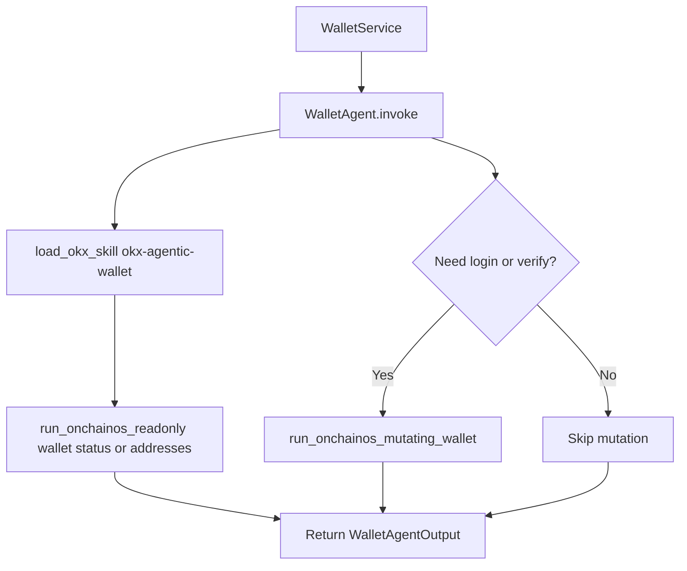
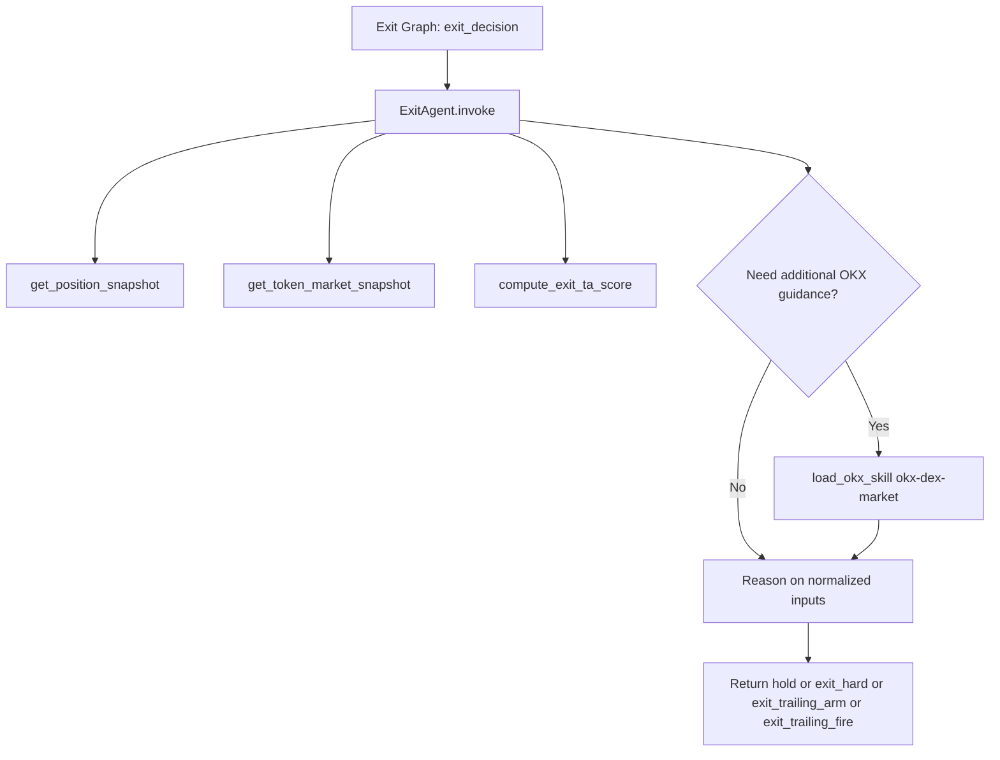
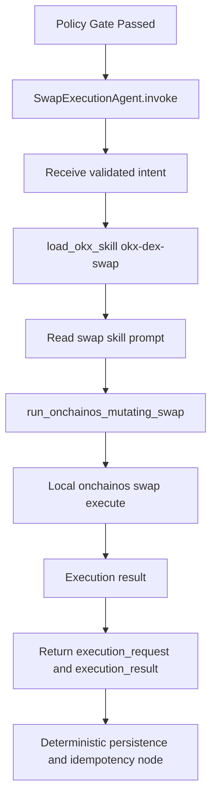
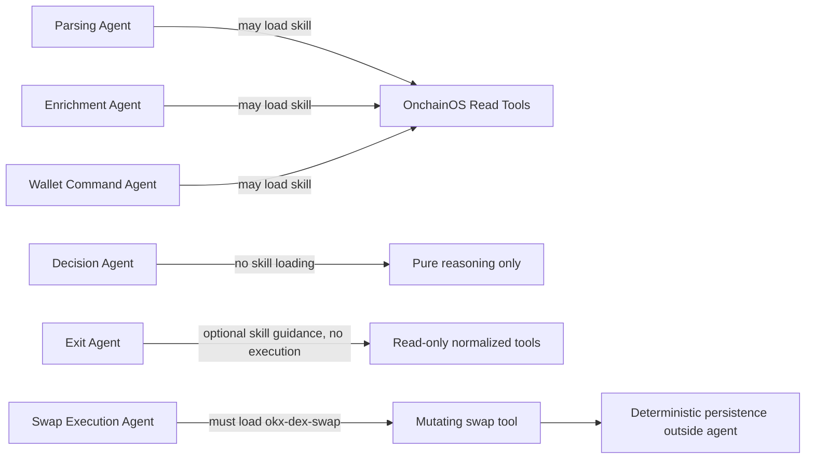

# Agent Skill Runtime

## Purpose

This document shows how the model-facing agents load OKX skills at runtime, when they do it, and how those skill prompts connect to `onchainos` command execution and structured outputs.

The important rule is:

- the application does not preload OKX skill text into prompts,
- the agent decides when to call `load_okx_skill(...)`,
- the skill text is loaded on demand from `okx-onchainos-skills/`,
- the agent then follows that skill guidance through bounded tools.

## Shared Runtime Pattern

```mermaid
flowchart LR
    A[LangGraph Node] --> B[LangChain Agent invoke]
    B --> C{Need OKX capability?}
    C -- No --> D[Reason on provided context]
    C -- Yes --> E[load_okx_skill]
    E --> F[OKXSkillRegistry.load_skill]
    F --> G[Read SKILL.md from okx-onchainos-skills]
    G --> H[Skill prompt returned to agent]
    H --> I{Need more detail?}
    I -- Yes --> J[load_okx_skill_reference]
    J --> K[Read reference file inside skill folder]
    I -- No --> L[Call bounded tool]
    K --> L
    L --> M[run_onchainos_readonly or run_onchainos_mutating_swap]
    M --> N[Local onchainos CLI on server]
    N --> O[Tool result returned to agent]
    O --> P[Structured output]
    D --> P
```

## Parsing Agent

When to load skill:

- when token identity is ambiguous,
- when the message has incomplete token clues,
- when the parser needs to resolve symbol / chain / contract hints before downstream steps.

Tools exposed:

- `load_okx_skill`
- `load_okx_skill_reference`
- `run_onchainos_readonly`

Expected OKX skills:

- `okx-dex-token`
- optionally `okx-dex-market`

Structured output produced:

- message classification,
- raw symbol / CA / chain hints,
- resolved symbol / contract / chain,
- optional token name and decimals.

## Enrichment Agent

When to load skill:

- after parsing and lane classification,
- before decision,
- to gather all external OKX-covered decision inputs.

Tools exposed:

- `load_okx_skill`
- `load_okx_skill_reference`
- `run_onchainos_readonly`

Expected OKX skills:

- `okx-agentic-wallet`
- `okx-dex-market`
- `okx-security`
- `okx-dex-token`
- `okx-dex-swap` when quote context is needed

Structured output produced:

- `wallet_snapshot`
- `market_snapshot`
- `risk_snapshot`
- optional `signal_overlay`

## Decision Agent

When to load skill:

- never in the current design.

This agent is intentionally pure reasoning after enrichment is complete.

Tools exposed:

- none

## Wallet Agent

When to load skill:

- on `/start`,
- on `/status`.

Tools exposed:

- `load_okx_skill`
- `load_okx_skill_reference`
- `run_onchainos_readonly`

Expected OKX skills:

- always `okx-agentic-wallet`

## Exit Agent

When to load skill:

- optionally during exit reasoning,
- but not for execution.

Current design keeps exit reasoning primarily on normalized position, market, and deterministic TA snapshots. Skill-loading remains available in case exit reasoning later needs deeper market guidance, but the agent does not directly execute trades.

Tools exposed:

- `load_okx_skill`
- `load_okx_skill_reference`
- `get_position_snapshot`
- `get_token_market_snapshot`
- `compute_exit_ta_score`

## Swap Execution Agent

When to load skill:

- only after deterministic policy approval,
- only for validated buy or sell intent,
- only inside execution nodes.

Tools exposed:

- `load_okx_skill`
- `load_okx_skill_reference`
- `run_onchainos_mutating_swap`

Expected OKX skill:

- `okx-dex-swap`

## Boundary Summary

## Implementation Mapping

The runtime pieces that make this work are:

- skill registry:
  - `system/app/services/okx_skills.py`
- agent-bound tools:
  - `system/app/tools/langchain_agent_tools.py`
- model-backed agent construction:
  - `system/app/agents/parsing.py`
  - `system/app/agents/enrichment.py`
  - `system/app/agents/decision.py`
  - `system/app/agents/wallet_command.py`
  - `system/app/agents/exit.py`
  - `system/app/agents/swap_execution.py`
