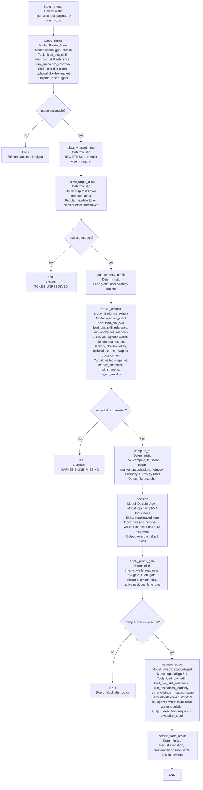
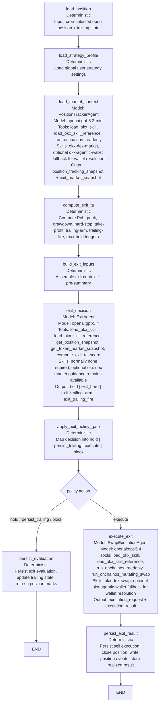

# Runtime Graph Charts

## Purpose

This document gives two implementation-facing Mermaid charts for the main runtime pipelines:

- signal intake -> follow trade execution
- scheduled exit evaluation -> exit execution

For each node, the chart shows:

- whether the node is deterministic or model-driven,
- which LangChain agent is used,
- which tools are exposed,
- which OKX OnchainOS skills the model is expected to load,
- which default model is configured today.

## Model Defaults

- `ParsingAgent` -> `openai:gpt-5.3-mini`
- `EnrichmentAgent` -> `openai:gpt-5.4`
- `DecisionAgent` -> `openai:gpt-5.4`
- `PositionTrackerAgent` -> `openai:gpt-5.3-mini`
- `ExitAgent` -> `openai:gpt-5.4`
- `SwapExecutionAgent` -> `openai:gpt-5.4`

## 1. Signal Intake and Follow Trade Pipeline

## 2. Exit Pipeline

## Reading Notes

- `ParsingAgent` is the only model node allowed to interpret raw Telegram language in the entry pipeline.
- `EnrichmentAgent` is the node that should gather OKX-covered external context, including wallet state, market data, kline data, and regular-token risk inputs.
- `DecisionAgent` is intentionally pure reasoning on already-collected data and does not call OKX tools.
- `PositionTrackerAgent` is the model node that refreshes live position and wallet PnL context for exit evaluation.
- `SwapExecutionAgent` is the only model node allowed to invoke bounded mutating swap execution, and only after deterministic policy approval.
